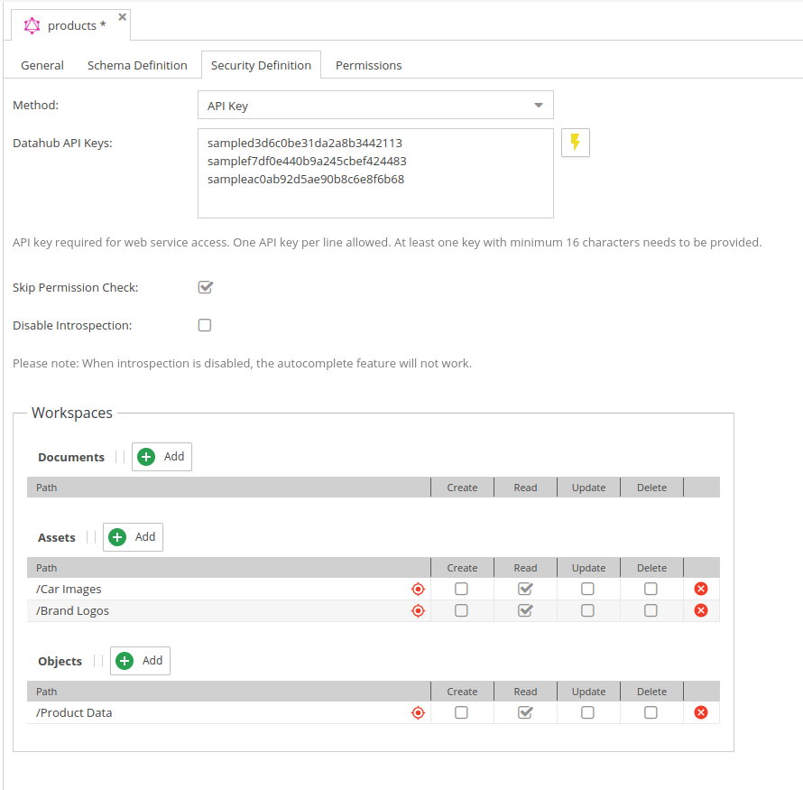

# Security Settings

The security settings define how the endpoint is secured and which data is accessible.

<div class="image-as-lightbox"></div>



## Authentication

Here you can define how users are authenticated when accessing the endpoint.

#### Supported Methods

* API Key: needs to be sent with every request.

#### API Key

To automatically create an API key use the button next to the input. 
For each click on the button a new API key is generated and will be added to the input field in addition to the list of existing keys.
Keys must be at least 16 characters long.

API keys are **not** stored in the YAML configuration file and are **not** part of the configuration export/import.
They are stored in the database table `plugin_datahub_api_keys` (one row per configuration, keys as a JSON array).
The keys are stored in plaintext so that they can be displayed in the admin UI again, therefore treat this table as a secret store:
restrict database access to it and never share dumps of it.

Keys that are still defined under `security.apikey` in a YAML configuration keep working (legacy fallback), but new keys should
only be managed via the admin UI / the `plugin_datahub_api_keys` table.

#### Sending the API Key

Send the key with every request in the `X-API-Key` HTTP header:

```
X-API-Key: <your-api-key>
```

The (legacy) `apikey` header is still accepted as well.

:::warning

Passing the key as query-string parameter (`?apikey=...`) is **deprecated** and will be removed in a future release.
A deprecation warning is logged when it is used. Use the `X-API-Key` header instead.

:::

#### Who may change the security settings

Only Datahub administrators (OpenDXP admins or users with the `plugin_datahub_admin` permission) may change the
security block (authentication method, API keys, skip permission check, introspection), the workspaces and the
SQL object condition of a configuration. Other users with update permission on a configuration may change the
remaining settings only; a save request that modifies these sections is rejected with HTTP 403.

## Introspection Settings

Introspection provides an information about queries which are supported by GraphQl schema. 
If introspection is enabled, the endpoint will provide a schema definition which can be used by GraphiQL or other tools to provide auto-completion and documentation.
If introspection is disabled, the schema definition will not be provided and therefore no auto-completion or documentation will be available.

This is currently enabled by default. It can be disabled via security settings tab directly in the backend or in the symfony configuration tree:
```
opendxp_data_hub:
    graphql:
        allow_introspection: false
```

## Workspace Settings

Defines workspaces for data that should be accessible via the endpoint.
The definition is similar to OpenDxp user [workspace permissions](https://docs.opendxp.io/docs/core-framework/Administration_of_OpenDxp/Users_and_Roles) 

:::warning

If no workspace is selected, no directories are accessible.

:::

Available permissions:
* Create
* Read
* Update
* Delete


## Error Handling  - Configuration Values

The default behavior for associated/related objects, documents or assets that are not visible for the
endpoint is, to simply null it out.

You can change that via a configuration setting in symfony configuration tree:
* 1 = the entire query will fail
* 2 = null it out/skip it for multi-relations (default)
 
```
opendxp_data_hub:
    graphql:
        not_allowed_policy: 2
```

It is also possible to disable the permission checks entirely by setting the configuration option
in the security definition tab.

## Request Limits and CORS

The following options in the symfony configuration tree protect the endpoint against
overly expensive queries and restrict cross-origin access. All limits are enabled by default.

```yaml
opendxp_data_hub:
    graphql:
        # Maximum nesting depth of a query (0 disables the check)
        query_depth_limit: 15
        # Maximum query complexity as computed by webonyx/graphql-php (0 disables the check)
        query_complexity_limit: 1000
        # Maximum value of the `first` argument in listings; listings without `first` use this value
        max_first: 1000
        # Origins that may call the endpoint with credentials. Empty list: every origin gets
        # `Access-Control-Allow-Origin: *` but never `Access-Control-Allow-Credentials`.
        cors_origins:
            - 'https://shop.example.com'
```

A `first` value above `max_first` is rejected with a client-safe error instead of being silently truncated.
